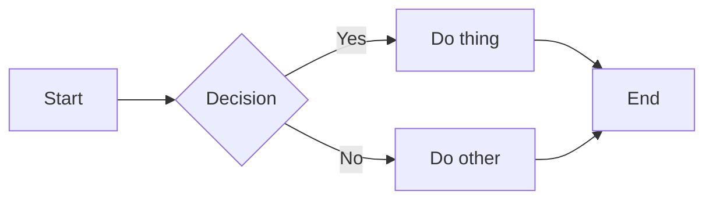

# \<html\> (adv.)
TJ Dev Club

---

# HTML

It's pretty:
- Awesome
  - s
- Cool
- Tuff
- Easy to brag about

---
layout: default
---

# HTML Example

```html {monaco-run}
<h1>HELLO SLIDEV</h1>
<p>ok this is actually so cool (crying emoji)</p>
```

---
layout: default
---

# TypeScript Example

```ts {monaco-run}
const x: number = 5;
console.log(x ** 5);
console.log(x ** 5);
console.log(x ** 5);
console.log(x ** 5);
console.log(x ** 5);
console.log(x ** 5);
console.log(x ** 5);
console.log(x ** 5);
console.log(x ** 5);
console.log(x ** 5);
console.log(x ** 5);
console.log(x ** 5);
console.log(x ** 5);
console.log(x ** 5);
console.log(x ** 5);
console.log(x ** 5);
console.log(x ** 5);
console.log(x ** 5);
console.log(x ** 5);
console.log(x ** 5);
console.log(x ** 5);
console.log(x ** 5);
console.log(x ** 5);
console.log(x ** 5);

console.log(x ** 5);

console.log(x ** 5);


```

---
layout: default
---
# MOVE MOVE MOVE

````md magic-move
```js
console.log(`Step ${1}`)
```
```js
console.log(`Step ${1 + 1}`)
```
```ts
console.log(`Step ${3}` as string)
```
````

---

# Diagrams

You can also do diagrams in Slidev. Probably useful for Dev Club at some point.
I still prefer Excalidraw though...
<br>
<br>


---

# Navigation

Hover on the bottom-left corner to see the navigation's controls panel

## Keyboard Shortcuts

|     |     |
| --- | --- |
| <kbd>space</kbd> / <kbd>tab</kbd> / <kbd>right</kbd> | next animation or slide |
| <kbd>left</kbd>  / <kbd>shift</kbd><kbd>space</kbd> | previous animation or slide |
| <kbd>up</kbd> | previous slide |
| <kbd>down</kbd> | next slide |

---
layout: image-right
image: https://cover.sli.dev
---

# Code

Use code snippets and get the highlighting directly!

```ts
interface User {
  id: number
  firstName: string
  lastName: string
  role: string
}

function updateUser(id: number, update: Partial<User>) {
  const user = getUser(id)
  const newUser = { ...user, ...update }
  saveUser(id, newUser)
}
```

---
layout: default
---

# HTML Code Highlighting Demo

```html {2,6-8,12-14} [index.html]
<!doctype html>
<html lang="en">
  <head>
    <meta charset="utf-8">
    <title>Highlight Demo</title>
  </head>
  <body>
    <header class="site-header">
      <h1>Hello, Slidev</h1>
      <nav>
        <a href="#">Home</a>
        <a href="#">Docs</a>
        <a href="#">About</a>
      </nav>
    </header>
  </body>
</html>
```

---
layout: last
---

# \</lecture\>