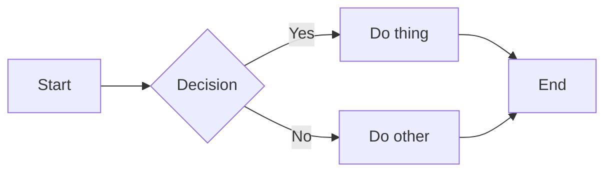

# \<html\> (adv.)

TJ Dev Club

---

# Quick HTML Refresher

- Markup language, little logic, little styling
- Forms the structure of the website
- \<tags\> and stuff

---

# Most important tags review: `\<div\>`

Basic general use element for **blocks**, not inline

Wrapping, making a box, menus, whatever needs to be a block.

```html {monaco-run}
Blah blah blah blah
<div style="border: solid">Box. Not inline.</div>
blah blah blah blah.
```

---

# Most important tags review: `\<span\>`

General use but inline.

Not as commonly used, but helpful.

```html {monaco-run}
Only highlight what is
<span style="border: solid">most important</span>
in your notes
```

---

# Review: basic text

```html {monaco-run}
<h1>Heading 1</h1>
<h2>Heading 2</h2>
<h3>Heading 3</h3>
<h4>Heading 4</h4>
<h5>Heading 5</h5>
<h6>Heading 6</h6>
<p>This is a paragraph</p>
<p>Auto line breaks after paragraph</p>
```

---

```yaml
layout: center
```

# Some more advanced tags

---

# `<meta>`

Various uses: Metadata, Instructions for browser, SEO, HTTP header simulation

---

# Viewport meta

Mobile devices act weird

Pretend their screen is really big, then zoom everything out so the entire page
can be see

Why? Many (old) sites don't optimize for mobile, so they only look good on large
screens.

---

# Viewport meta

Simulated mobile view. Everything is too small, must zoom in.


---

# Viewport meta

What we want. We tell the phone not to automatically zoom out.


---

# Viewport meta

```html
<meta name="viewport" content="width=device-width, initial-scale=1.0" />
```

Set `width` to `device-width`. `width` means VIRTUAL VIEWPORT width

Set `initial-scale` to `1.0`. `scale` means ZOOM level, 1.0 means no zoom in or
out

---

## layout: default

# HTML Example

```html {monaco-run}
<h1>HELLO SLIDEV</h1>
<p>ok this is actually so cool (crying emoji)</p>
```

---

## layout: default

# TypeScript Example

```ts {monaco-run}
const x: number = 5;
console.log(x ** 5);
console.log(x ** 5);
console.log(x ** 5);
console.log(x ** 5);
console.log(x ** 5);
console.log(x ** 5);
console.log(x ** 5);
console.log(x ** 5);
console.log(x ** 5);
console.log(x ** 5);
console.log(x ** 5);
console.log(x ** 5);
console.log(x ** 5);
console.log(x ** 5);
console.log(x ** 5);
console.log(x ** 5);
console.log(x ** 5);
console.log(x ** 5);
console.log(x ** 5);
console.log(x ** 5);
console.log(x ** 5);
console.log(x ** 5);
console.log(x ** 5);
console.log(x ** 5);

console.log(x ** 5);

console.log(x ** 5);
```

---

## layout: default

# MOVE MOVE MOVE

````md magic-move
```js
console.log(`Step ${1}`);
```

```js
console.log(`Step ${1 + 1}`);
```

```ts
console.log(`Step ${3}` as string);
```
````

---

# Diagrams

You can also do diagrams in Slidev. Probably useful for Dev Club at some point.
I still prefer Excalidraw though... <br> <br>



---

# Navigation

Hover on the bottom-left corner to see the navigation's controls panel

## Keyboard Shortcuts

|                                                      |                             |
| ---------------------------------------------------- | --------------------------- |
| <kbd>space</kbd> / <kbd>tab</kbd> / <kbd>right</kbd> | next animation or slide     |
| <kbd>left</kbd> / <kbd>shift</kbd><kbd>space</kbd>   | previous animation or slide |
| <kbd>up</kbd>                                        | previous slide              |
| <kbd>down</kbd>                                      | next slide                  |

---

layout: image-right image: https://cover.sli.dev

---

# Code

Use code snippets and get the highlighting directly!

```ts
interface User {
  id: number;
  firstName: string;
  lastName: string;
  role: string;
}

function updateUser(id: number, update: Partial<User>) {
  const user = getUser(id);
  const newUser = { ...user, ...update };
  saveUser(id, newUser);
}
```

---

## layout: default

# HTML Code Highlighting Demo

```html {2,6-8,12-14} [index.html]
<!doctype html>
<html lang="en">
  <head>
    <meta charset="utf-8" />
    <title>Highlight Demo</title>
  </head>
  <body>
    <header class="site-header">
      <h1>Hello, Slidev</h1>
      <nav>
        <a href="#">Home</a>
        <a href="#">Docs</a>
        <a href="#">About</a>
      </nav>
    </header>
  </body>
</html>
```

---

## layout: last

# \</lecture\>
